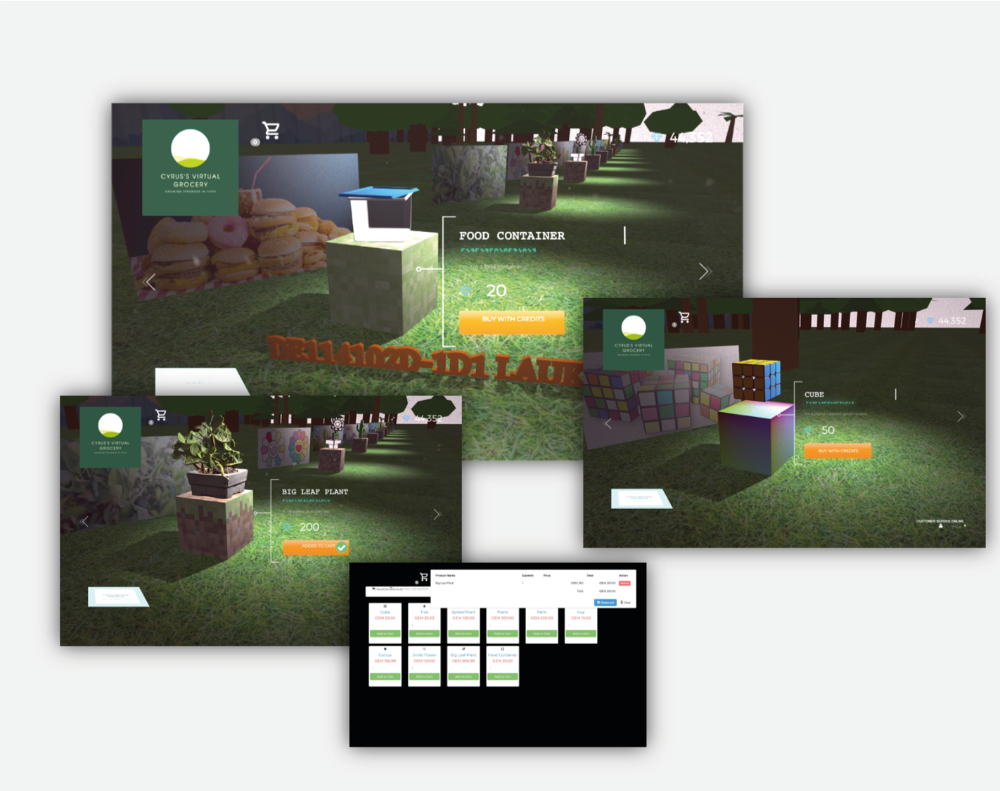

# A-3D-Grocery-Shop-using-ThreeJS

Applied programming techniques to deconstruct a 3D Grocery Shop to build a creative browsing experience on an e-commerce site.

Demo Video: https://www.youtube.com/watch?v=mO_ScP_HDs8

Static Website (no backend connection): https://cyruslauwork.github.io/A-3D-Grocery-Shop-using-ThreeJS/

Credit List:

- Muhammed Erdem https://github.com/muhammed/vue-interactive-paycard

- Jamie Coulter https://codepen.io/jcoulterdesign/pen/ryzvqG
